# Linux启动过程 （第三部分）

## 0 从实模式切换到保护模式

上一篇文件介绍了Linux内核的引导过程，本文继续分析从实模式准备切换到保护模式的过程。

## 1 保护模式介绍

保护模式([Protected mode](https://en.wikipedia.org/wiki/Protected_mode))是80286及之后系列CPU的运行模式。在长模式出现前，是Intel CPU的主要运行模式。淘汰实模式，使用保护模式的主要原因是在实模式下系统能够访问的内存非常有限，只有1M。

保护模式和实模式的主要区别集中在内存管理上，地址总线由实模式的`20bit`提升到保护模式的`32bit`，可以访问的地址空间由1MiB提升到4GiB。同时，保护模式引入了内存分页([Memory paging](https://en.wikipedia.org/wiki/Memory_paging))，运行特权等级([Protection ring](https://en.wikipedia.org/wiki/Protection_ring))等。

在保护模式下，支持分段([segmentation](https://en.wikipedia.org/wiki/X86_memory_segmentation))和分页([[paging](https://en.wikipedia.org/wiki/Memory_paging)])两种方式。分页模式在后续讨论，目前只讨论分段模式。

前面讨论过，在实模式下只能通过分段访问物理地址，计算方式为：

```C
address = segment * 16 + offset
```

### 1.1 段描述符(Segment Descriptor)

在保护模式下，内存分段方式和实模式完全不同，每个内存段不再是固定64K大小，段的大小和起始位置通过[段描述符(Segment Descriptor)](https://en.wikipedia.org/wiki/Segment_descriptor)来表示。段描述符放在[全局描述符表(Global Descriptor Table,GDT)]((https://en.wikipedia.org/wiki/Global_Descriptor_Table))或局部描述符表(Local Descriptor Table,LDT)中。同时`offset`的长度由实模式下的16bit提升到保护模式下的32bit。

通常只有一个GDT，每个进程除了存放在GDT中段之外，如果还需要创建附加的段，可以使用自己的LDT。GDT内存的地址和大小放在`gdtr`寄存器中，当前使用的LDT的地址和大小放在`ldtr`寄存器中。

段描述符长度为8字节，结构描述如下：

```text
|63 --—--- 56|55| 54|53|52|51 ------ 48|47|46|45|44|  43| 42| 41|40|39 ----— 32|
--------------------------------------------------------------------------------
|Base [31:24]| G|D/B| L| A|Limit[19:16]| P| DPL | S|Type|C/E|R/W| A|Base[23:16]|
--------------------------------------------------------------------------------
|Base [15:0]                           |Limit[15:0]                            |
--------------------------------------------------------------------------------
|31                                  16|15                                    0|   
```

字段说明如下：

* Base = Base Address
  段的起始地址，32bit。
* Limit = Segment Limit
  段的长度，20bit。
* G = Granularity
  粒度标志。
  如果该位为0，则段大小以字节为单位，最大可以访问`2^20 = 1MB`的地址空间；
  该位为1，段大小为4096字节为单位，最大可以访问`2^20*2^12=2^32 = 4GB`的地址空间。
* D/B
  Default/Big flag，表示操作数的大小。1表示为32位段；0表示16位段。在代码段和数据段的情况下有所不同。
  * 代码段。D标志。1表示为32位代码段；0表示16位代码段。
  * 数据段。B标志。1表示数据段的上界限为32bit（最大`0xffffffff`）；0表示上界限为16bit（最大 `0xffff`）。
* L = Long
  1表示为64bit段，段中使用64bit指令码。**`L`不能和`D/B`同时设置1。**
* AVL = Available
  仅软件使用，硬件不使用。Linux忽略改字段。
* P = Present
  `Segment-Present`标志。1表示段在内存中；0表示段当前不在内存中，对段的访问触发`段不存在`异常。
* DPL = Descriptor privilege level
  特权级描述符，用于限制改段的存取。Linux使用`0：内核态`（只能在内核态访问）和`3:用户态`（所有等级都能访问）两种等级。
* S = System
  系统标志。0表示为系统段，用来存储LDT，TSS等关键数据结构；1表示代码段或数据段。
* Type
  1表示代码段；0表示数据段或堆栈。代码段使用`D`,`C`,`R`标志；数据段使用`B`,`E`,`W`标志。
* C = Conforming
  这个段的代码是否可以被低级别权限访问。1表示可以被低级别权限访问；0表示只能被同级别权限访问。
* E=Expand-Down
  0表示数据段从基地址向上扩展，最大为base + limit；1表示从基地址向下扩展，通常用于栈。
* R=Readable
  0表示改段不可读，只可执行。代码段默认是可执行的。
* W=Writable
  1表示改段可写；0表示不可写。数据段模式是可读的。
* A=Accessed
  1表示已访问；0表示没有访问。段访问时由硬件设置，由软件清除。

### 1.2 段选择符(Segment Selector)

在实模式下，使用段寄存器(Segment Register)可以直接表示选择的段（使用`%cs`作为段寄存器）。在保护模式下，段标识符用段选择符(Segment Selector)来表示，每个段描述符都对应一个段选择符。段选择符是一个16位长度的字段，结构描述如下：

```text
|15 -------- 3| 2|1 0|
----------------------
|     Index   |TI|RPL|
----------------------
```

字段说明如下：

* Index
  表示在GDT或LDT中段描述符的索引。
* TL = Table Indicator
  TL标志指示该描述符是GDT中(TI=0)还是在LDT(TI=1)中。
* PRL = Requested Privilege Level
  请求特权等级。

由于一个段描述符长度为8字节，因此段选择符在GDT或LDT内部的相对地址为段选择符的最高13bit值乘以8得到的。例如：如果GDT在`gdtr`寄存器中的地址为`0x20000`，段选择符的索引值为2，那么相应的段描述符的地址为：`0x20000 + 2 * 8 = 0x20010`。

GDT的第一项总是设置为0，确保空选择符的逻辑地址是无效的。在GDT中断描述符的最大数量为`8191`，即`2^13 - 1`。

### 1.3 线性地址计算过程

1. 将段选择符加载到段寄存器中，首先检查段选择符的TI字段，决定段描述符在GDT中还是LDT中；
2. 从段选择符的Index字段计算段描述符的地址，即：`gdtr/ldtr + index * 8`;
3. 在没有开启分页的情况下，线性地址（或物理地址）= 段描述符的Base + offset。

转换过程如下图所示：


### 1.4 进入保护模式步骤

1. 禁用中断；
2. 加载GDTR，`lgdt gdtr`;
3. 设置`CR0`寄存器`PE`(Protection Enable)保护位；
4. 跳转执行保护模式代码。

## 2 进入保护模式

在上一篇的最后，我们调用`go_to_protected_mode`函数，准备切换到保护模式。`go_to_protected_mode`在[arch/x86/boot/pm.c](https://github.com/torvalds/linux/blob/v5.4/arch/x86/boot/pm.c#L102)中实现。整个过程如下：

### 2.1 实模式切换钩子函数（`realmode_switch_hook`）

第一个调用的函数是`realmode_switch_hook`，该函数通过钩子函数或直接禁用中断。代码如下：

```C
/*
 * Invoke the realmode switch hook if present; otherwise
 * disable all interrupts.
 */
static void realmode_switch_hook(void)
{
	if (boot_params.hdr.realmode_swtch) {
		asm volatile("lcallw *%0"
			     : : "m" (boot_params.hdr.realmode_swtch)
			     : "eax", "ebx", "ecx", "edx");
	} else {
		asm volatile("cli");
		outb(0x80, 0x70); /* Disable NMI */
		io_delay();
	}
}
```

`boot_params.hdr.realmode_swtch`是一个实模式下函数地址，指向的函数将禁止[NMI](http://en.wikipedia.org/wiki/Non-maskable_interrupt)中断，在BootLoader运行在特定环境下（如：DOS下LOADIN），`realmode_swtch`才会设置。在Boot Protocol中[Advanced Boot Loader Hooks](https://github.com/torvalds/linux/blob/v5.4/Documentation/x86/boot.rst#advanced-boot-loader-hooks)有详细说明。

在QEMU中没有相关设置说明，将执行`else`部分。`cli`指令清除了中断标志`IF`，外部中断就被禁止了；`outb(0x80, 0x70)`禁用了NMI；`io_delay`设置了短暂的延时等待I/O完成。

### 2.2 启用A20地址（`enable_a20`）

第二个调用的函数是`enable_a20`，该函数启用[A20 line](https://en.wikipedia.org/wiki/A20_line)，该函数在[arch/x86/boot/a20.c](https://github.com/torvalds/linux/blob/v5.4/arch/x86/boot/a20.c#L128)中定义。

通过`enable_a20_bios`, `empty_8042`, `enable_a20_kbc`, `enable_a20_fast`等方法启用A20地址线。`a20_test_short`和`a20_test_long`调用`a20_test(int loops)`来检查A20地址线是否启用。

A20检查失败后，输出失败信息后调用`die`。

### 2.3 重置CPU、禁用所有中断

`reset_coprocessor`重置CPU，`mask_all_interrupts`禁用[PIC,Programmable interrupt controller](https://en.wikipedia.org/wiki/Programmable_interrupt_controller)中断。这个函数均通过`outb`进行设置。

### 2.4 设置中断描述符（`setup_idt`）

`setup_idt`设置[中断描述符表（Interrupt descriptor table,IDT）](https://en.wikipedia.org/wiki/Interrupt_descriptor_table)。设置了`null_idt`，`null_idt`的长度为0，即所有的中断调用都是空的。

```C
	static const struct gdt_ptr null_idt = {0, 0};
	asm volatile("lidtl %0" : : "m" (null_idt));
```

### 2.5 设置全局描述符（`setup_gdt`）

`setup_gdt`设置引导阶段需要的GDT信息。`boot_gdt`定义了需要的段描述符，包括：代码段（CS），数据段（DS）和任务状态段（TSS）。设置TSS段是为了兼容Intel VT，在实际中并未使用。

```C
	/* There are machines which are known to not boot with the GDT
	   being 8-byte unaligned.  Intel recommends 16 byte alignment. */
	static const u64 boot_gdt[] __attribute__((aligned(16))) = {
		/* CS: code, read/execute, 4 GB, base 0 */
		[GDT_ENTRY_BOOT_CS] = GDT_ENTRY(0xc09b, 0, 0xfffff),
		/* DS: data, read/write, 4 GB, base 0 */
		[GDT_ENTRY_BOOT_DS] = GDT_ENTRY(0xc093, 0, 0xfffff),
		/* TSS: 32-bit tss, 104 bytes, base 4096 */
		/* We only have a TSS here to keep Intel VT happy;
		   we don't actually use it for anything. */
		[GDT_ENTRY_BOOT_TSS] = GDT_ENTRY(0x0089, 4096, 103),
	};
```

在[arch/x86/include/asm/segment.h](https://github.com/torvalds/linux/blob/v5.4/arch/x86/include/asm/segment.h#L21)文件中定义了分段信息。其中`GDT_ENTRY_BOOT_CS`的值为`2`, `GDT_ENTRY_BOOT_DS`的值为`3`, `GDT_ENTRY_BOOT_TSS`的值为`4`，因此`boot_gdt`占用了5个段（包含：Index为0的默认段，Index为1时未使用），`aligned(16)`意味着按照16字节对齐，因此`boot_gdt`的大小为48字节。

`GDT_ENTRY`是个宏定义，通过`flags, base, limit`三个参数来组成段描述符。

```C
#define GDT_ENTRY(flags, base, limit)			\
	((((base)  & _AC(0xff000000,ULL)) << (56-24)) |	\
	 (((flags) & _AC(0x0000f0ff,ULL)) << 40) |	\
	 (((limit) & _AC(0x000f0000,ULL)) << (48-16)) |	\
	 (((base)  & _AC(0x00ffffff,ULL)) << 16) |	\
	 (((limit) & _AC(0x0000ffff,ULL))))
```

以`GDT_ENTRY(0xc09b, 0, 0xfffff)`为例，生成的段描述符的基址（Base）为0，段长度（Limit）为 `0xfffff`(1MB)，标志展开后的二进制为：

```text
1100 0000 1001 1011
```

对应的字段含义依次为：

* 1 - (G) 这里为 1，表示段的实际长度是 0xfffff * 4kb = 4GB；
* 1 - (D) 表示这个段是一个32位段；
* 0 - (L) 这个代码段没有运行在 long mode；
* 0 - (AVL) Linux 没有使用；
* 0000 - 段长度的4个位；
* 1 - (P) 段已经位于内存中；
* 00 - (DPL) - 段优先级为0；
* 1 - (S) 说明这个段是一个代码或者数据段；
* 1 - （Type）说明为代码段;
* 0 - (C) 只能被同级别权限访问;
* 1 - (R) 段可执行/可读;
* 1 - (A) 段可访问；

具体字段说明可以参考上一章节，或者参考[Intel® 64 and IA-32 Architectures Software Developer Manuals](https://www.intel.com/content/www/us/en/developer/articles/technical/intel-sdm.html)。

设置完成GDT列表后，将GDT信息存放到`gdt_ptr`并写入`gdtr`寄存器中。`(ds() << 4)`偏移4位，是因为目前还在实模式下。

```C
    static struct gdt_ptr gdt;
    gdt.len = sizeof(boot_gdt)-1;
    gdt.ptr = (u32)&boot_gdt + (ds() << 4);
    asm volatile("lgdtl %0" : : "m" (gdt));
```

### 2.6 切换到保护模式（`protected_mode_jump`）

`protected_mode_jump`实现从实模式到保护模式的切换。在[arch/x86/boot/pmjump.S](https://github.com/torvalds/linux/blob/v5.4/arch/x86/boot/pmjump.S#L24)中实现。

`protected_mode_jump`使用两个参数，`code32_start`的值（保存在`%eax`寄存器中）和`boot_params`的地址（保存在`%edx`寄存器中）。主要执行过程如下：

1. 首先保存`%edx`的值，设置`%bx`,`%ebx`为标签2的地址，即：`(%cs << 4) + in_pm32`的地址；

    ```C
      movl	%edx, %esi		# Pointer to boot_params table

      xorl	%ebx, %ebx
      movw	%cs, %bx
      shll	$4, %ebx
      addl	%ebx, 2f
      jmp	1f			# Short jump to serialize on 386/486
    ```

2. 接下来，将数据段描述符（DS）和任务状态段描述符（TSS）放到`%cs`和`%di`集群器中；

    ```C
        movw	$__BOOT_DS, %cx
        movw	$__BOOT_TSS, %di
    ```

    `__BOOT_DS`和`__BOOT_TSS`在[arch/x86/include/asm/segment.h](https://github.com/torvalds/linux/blob/v5.4/arch/x86/include/asm/segment.h#L24)中定义的，分别为：`__BOOT_DS (GDT_ENTRY_BOOT_DS*8)`, `__BOOT_TSS (GDT_ENTRY_BOOT_TSS*8)`，即：`3*8 = 24`和`4*8 = 32`。

3. 接下来，通过设置`%CR0`寄存器的PE位使CPU保护模式；

    ```C
        movl	%cr0, %edx
        orb	$X86_CR0_PE, %dl	# Protected mode
        movl	%edx, %cr0
    ```

4. 通过长跳转进入保护模式；

   ```C
        # Transition to 32-bit mode
        .byte	0x66, 0xea		# ljmpl opcode
    2:	.long	in_pm32			# offset
        .word	__BOOT_CS		# segment
   ```

   其中：
   * `0x66` 运行混合执行16位和32位代码；
   * `0xea` 长跳转指令；
   * `in_pm32` 跳转的偏移量;
   * `__BOOT_CS` 跳转的代码段，其值为：`2*8 = 16`;

   执行跳转指令后，我们终于进入保护模式。

   ```C
   	.code32
	.section ".text32","ax"
   ```

5. 保护模式下重置寄存器
   * 将`%ecx`（保存`$__BOOT_DS`的值）传递给`%ds`,`%es`,`%fs`,`%gs`,`%ss`；
   * `%cs`值已经为`__BOOT_CS`；
   * 设置`%esp`的值，初始化了一个有效的栈;
   * 将`%ecx, %edx, %ebx, %ebp, %edi`置零；

6. 长跳转到32位代码入口点

   ```C
   jmpl    *%eax
   ```

   `%eax`保存的是32位入口点地址，即`code32_start`。`code32_start`的默认值为：`0x100000`，在[Boot Protocol](https://github.com/torvalds/linux/blob/v5.4/Documentation/x86/boot.rst#memory-layout)也由相关说明。
  
   ```C
    #https://github.com/torvalds/linux/blob/v5.4/arch/x86/boot/header.S#L330
    code32_start:           # here loaders can put a different
                            # start address for 32-bit code.
    .long   0x100000        # 0x100000 = default for big kernel
   ```

   ```text
   When using bzImage, the protected-mode kernel was relocated to 0x100000 ("high memory")。
   ```
  
   `code32_start`可用通过其他方式设置，在Boot Protocol中[Advanced Boot Loader Hooks](https://github.com/torvalds/linux/blob/v5.4/Documentation/x86/boot.rst#advanced-boot-loader-hooks)有详细说明。
  
## 3 结束语

本文描述了Linux内核从实模式到保护模式的切换过程等。我们将在下一篇中继续分析Linux内核在保护模式的引导过程。

本系列文章翻译自[linux-insides](https://github.com/0xAX/linux-insides)，如果你有任何问题或者建议，请联系[0xAX](https://twitter.com/0xAX)或者创建 [issue](https://github.com/0xAX/linux-internals/issues/new)。

如果你发现中文翻译有任何问题，请提交[PR](https://github.com/mannkafai/linux-insides-zh)或者创建[issue](https://github.com/mannkafai/linux-insides-zh/issues/new)。
