# Linux启动过程 （第四部分）

## 0 从保护模式切换到长模式

上一篇文件分析了Linux内核切换到保护模式的过程。由于长模式的存在，在保护模式下仅用于引导进入长模式。本文继续分析Linux内核从保护模式切换到长模式的过程。

## 1 长模式介绍

[长模式(Long mode)](https://en.wikipedia.org/wiki/Long_mode)是[x86_64](https://en.wikipedia.org/wiki/X86-64)的原生模式。长模式是保护模式的扩展，由64bit模式和兼容模式两个子模式组成。和保护模式的区别是长模式提供了新的功能，包括

* 通用寄存器的数量由8个（即eax、ecx、edx、ebx、esp、ebp、esi、edi）增加到了 16 个（即RAX，RCX，RDX，RBX，RSP，RBP，RSI，RDI，R8，R9，R10，R11，R12，R13，R14，R15）；
* 所有的通用寄存器由32bit扩展到64bit；
* 一个64bit相对地址指针寄存器，`%RIP`，在访问位置无关代码时更加高效;
* 64bit的地址空间；
  
从保护模式切换到长模式需要进行以下操作：

* 启用PAE；
* 建立页表并顶级页表加载到`cr3`寄存器中；
* 启用`EFER.LME`；
* 启用分页；

### 1.1 分页介绍

分页([Memory paging](https://en.wikipedia.org/wiki/Memory_paging))是一种内存管理方案，是分页单元(page unit)将线性地址转换为物理地址的机制。在分页模式下，线性地址分成固定长度为单位的页(page)，页内部连续的线性地址被映射到连续的物理地址中。分页单元把所有的RAM分成固定大小的页框(page frame)，每个页框的长度与页的长度一致。把线性地址映射到物理地址的数据结构称为页表(page table)，页表存放在内存中，在启用分页单元前由内核对页表进行初始化。

从`80386`开始，所有的80x86处理器都支持分页，通过设置`%cr0`寄存器PG标志启用。正在使用的顶级页表地址存放在`%cr3`寄存器中。

常见的分页模式包括：32位分页、PAE扩展分页、IA-32e分页三种方式。这种分页方式在页大小、页表级别上有所区别。

### 1.2 Linux中分页

Linux内核采用[4级/5级](https://github.com/torvalds/linux/blob/v5.4/Documentation/x86/x86_64/5level-paging.rst)分页模式。以64bit下常用的4级分页模式为例，页大小为4KB，4级页表分别称为：

* 4级页表，页全局目录（Page Global Directory），或者 PML4（Page Map Level 4）
* 3级页表，页上层目录（Page Upper Directory），或者PDP（Page Directory Pointer）
* 2级页表，页中间目录（Page Middle Directory），或者PD（Page Directory）
* 1级页表，页表项（Page Table Entry）

`cr3`是一个64位的寄存器，用于存储最高层结构的地址（`PML4`或`Page Global Directory`），其结构如下：

```text
63                  52 51                                        32
 -------------------------------------------------------------------
|                     |                                             |
|    Reserved MBZ     |      Address of the top level structure     |
|                     |                                             |
 -------------------------------------------------------------------
31                                  12 11      5   4   3   2      0
 -------------------------------------------------------------------
|                                     |          | P | P |          |
|  Address of the top level structure | Reserved | C | W | Reserved |
|                                     |          | D | T |          |
 -------------------------------------------------------------------
```

字段含义如下：

* 位63:53 - 保留，但必须为0;
* 位51:12 - 存储最高层分页结构的地址；
* 位11:5 - 保留，但必须为0;
* 位4:3 - PWT(Page-Level Writethrough)和PCD(Page-level Cache Disable)。控制页或者页表被硬件缓存处理的方式；
* 位2:0 - 忽略；

页表（Page Table）的结构如下，其定义可参见[arch/x86/include/asm/pgtable_types.h](https://github.com/torvalds/linux/blob/v5.4/arch/x86/include/asm/pgtable_types.h)：

```text
 63  62                 52 51                                                           32
 ------------------------------------------------------------------------------------------
| N |                     |                                                                |
|   |     Available       |          Address of the paging structure on lower level        |
| X |                     |                                                                |
 ------------------------------------------------------------------------------------------
 31                                            12 11  9  8   7   6   5   4   3   2   1   0
 ------------------------------------------------------------------------------------------
|                                                |     |   | P |   |   | P | P | U | W |   |
| Address of the paging structure on lower level | AVL | G | A | D | A | C | W | / | / | P |
|                                                |     |   | T |   |   | D | T | S | R |   |
 ------------------------------------------------------------------------------------------
```

字段含义如下：

* 位63 - NX(No Execute Bit)， 不可执行位；
* 位63:52 - CPU忽略位，由系统软件使用；
* 位51:12 - 分页结构的物理地址；
* 位11:9 - CPU忽略位，由系统软件使用；
* 位8 - G(Global)，在`%CR4.PGE = 1`时，是否全局转换；否则忽略；
* 位7 - PAT；间接确认是否为4KB页；
* 位7 - PS(Page Size)；页大小为4MB或2MB；
* 位6 - D(Dirty)；指示软件是否写入该页；
* 位5 - A(Accessed)；指示软件是否访问了该页
* 位4 - PCD(Page-level cache disable)
* 位3 - PWT(Page-level write-through)；
* 位2 - U/S(User/supervisor)；表示该页的访问权限；0表示用户模式不能访问；
* 位1 - R/W(Read/Write)；表示该页是否可写；
* 位0 - P(Present)；存在位，表示当前页表或物理页是否加载到内存中；4KB页时，必须为1；

Linux使用4级页表时，每级页表长度为`9bit`，offset为`12bit`，可以访问`9+9+9+9+12=48bit`或(256TiB)的地址空间。地址转换过程如图所示：


## 2. 保护模式的入口点

保护模式(32位)入口点的定义在[arch/x86/boot/compressed/head_64.S](https://github.com/torvalds/linux/blob/v5.4/arch/x86/boot/compressed/head_64.S#L46)中。代码如下：

```C
	__HEAD
	.code32
ENTRY(startup_32)
```

这个目录叫做`compressed（压缩的）`，是因为`bzimage`由`引导头（header）`, `内核引导代码（kernel setup code）`, `vmlinux`三部分经过压缩后形成的。前几章节已经分析了内核引导代码的执行过程。`head_64.S`的功能是在保护模式下切换到长模式，在长模式下解压内核。

在`arch/x86/boot/compressed`目录下有两个文件：`head_32.S`和`head_64.S`，分别对应`x86_32`和`x86_64`的CPU架构。目前主要使用的`x86_64`架构的CPU，所以我们只关注`head_64.S`。

在[arch/x86/boot/compressed/Makefile](https://github.com/torvalds/linux/blob/v5.4/arch/x86/boot/compressed/Makefile#L75)中，可以找到生成目标：

```C
vmlinux-objs-y := $(obj)/vmlinux.lds $(obj)/head_$(BITS).o $(obj)/misc.o \
	$(obj)/string.o $(obj)/cmdline.o $(obj)/error.o \
	$(obj)/piggy.o $(obj)/cpuflags.o
```

生成目标中包括 `$(obj)/head_$(BITS).o` ，这意味着我们将会选择基于`$(BITS)`设置的文件执行链接操作，即`head_32.o`或者 `head_64.o`。`$(BITS)`在[arch/x86/Makefile](https://github.com/torvalds/linux/blob/v5.4/arch/x86/Makefile#L64)中定义的：

```bash
ifeq ($(CONFIG_X86_32),y)
        BITS := 32
        ...
        ...
else
        BITS := 64
        ...
        ...
endif
```

## 3. 保护模式下引导过程（`startup_32`）

在保护模式的入口点函数（即`startup_32`）前，对`startup_32`函数有`__HEAD`符合限定。`__HEAD` 在[include/linux/init.h](https://github.com/torvalds/linux/blob/v5.4/include/linux/init.h#L95) 中定义，`.head.text`为section名称，`ax`表示为可执行段，即代码段。

```C
#define __HEAD		.section	".head.text","ax"
```

### 3.1 重新设置段地址

`startup_32`函数首先通过`cld`指令清除`DF`([Direction_flag](https://en.wikipedia.org/wiki/Direction_flag))标记位，这意味着从低地址到高地址处理字符串；接下来判断`loadflags`中的`KEEP_SEGMENTS`标记，如果未设置，重新设置`%ds`,`%es`,`%ss`为`__BOOT_DS`。如下：

```C
	cld
	testb $KEEP_SEGMENTS, BP_loadflags(%esi)
	jnz 1f

	cli
	movl	$(__BOOT_DS), %eax
	movl	%eax, %ds
	movl	%eax, %es
	movl	%eax, %ss
```

设置寄存器正确的值后，计算内核实际运行位置和加载内核位置的差值。由于`.head.text`的起始位置为`. = 0`，而实际加载内核的起始地址为`0x100000`, 需要计算正确的`%ebp`。在长模式下`%rip`寄存器保存相对地址的偏移，但目前我们仍运行在保护模式下，在保护模式使用一个常用的方式获取函数地址，即通过定义一个标签，跳转到该标签，然后把栈顶抛出到一个寄存器中。如下：

```C
call label
label: pop %reg
```

在上述指令执行后，`%reg`包含`label`的地址。Linux内核在`startup_32`函数中也使用同样的方式来获取地址。如下：

```C
	leal	(BP_scratch+4)(%esi), %esp
	call	1f
1:	popl	%ebp
	subl	$1b, %ebp
```

在进入保护模式前，`%esi`寄存器保存的是`boot_params`的地址。`boot_params`结构在`0x1e4`偏移的位置包含一个特殊的字段`BP_scratch`，它为`call`指令建立了一个4字节的临时栈。我们设置`%esp`为`BP_scratch`地址之后的四个字节。我们从`BP_scratch`的基地址加上`4`字节，是因为这是个临时栈，栈在`x86_64`架构自上到下增长。接下来，我们调用`1f`标签，并弹出栈顶到`%ebp`寄存器。在获取到`1f`标签的地址后，我们很容易获取`startup_32`的函数地址。

`startup_32`函数被链接运行在`0x0`的地址，`1f`标签的地址即为偏移量，即`0x21`字节。`%ebp`寄存器包含`1f`标签的实际物理地址，我们减去`1f`的偏移量即获取到`startup_32`函数实际运行的物理地址。根据Linux引导协议，保护模式的地址为`0x100000`。我们可以通过GDB来验证，在`1f`标签的位置（即，`0x100021`）设置断点，一切正常的情况下，`%ebp`寄存器的值为`0x100021`。验证过程如下：

```bash
(gdb) b *0x100000
Breakpoint 1 at 0x100000
(gdb) c
Continuing.

Thread 1 hit Breakpoint 1, 0x0000000000100000 in ?? ()
(gdb) info registers 
rax            0x100000            1048576
rbx            0x0                 0
rcx            0x0                 0
rdx            0x0                 0
rsi            0x148b0             84144
rdi            0x0                 0
rbp            0x0                 0x0 <fixed_percpu_data>
rsp            0x1ff80             0x1ff80 <ftrace_stacks+5824>
r8             0x0                 0
r9             0x0                 0
r10            0x0                 0
r11            0x0                 0
r12            0x0                 0
r13            0x0                 0
r14            0x0                 0
r15            0x0                 0
rip            0x100000            0x100000
eflags         0x46                [ IOPL=0 ZF PF ]
cs             0x10                16
ss             0x18                24
ds             0x18                24
es             0x18                24
fs             0x18                24
gs             0x18                24
...

(gdb) b *0x100022
Breakpoint 2 at 0x100022
(gdb) c
Continuing.

Thread 1 hit Breakpoint 2, 0x0000000000100022 in ?? ()
(gdb) info registers 
rax            0x18                24
rbx            0x0                 0
rcx            0x0                 0
rdx            0x0                 0
rsi            0x148b0             84144
rdi            0x0                 0
rbp            0x100021            0x100021
rsp            0x14a98             0x14a98 <bts_ctx+10904>
r8             0x0                 0
r9             0x0                 0
r10            0x0                 0
r11            0x0                 0
r12            0x0                 0
r13            0x0                 0
r14            0x0                 0
r15            0x0                 0
rip            0x100022            0x100022
eflags         0x46                [ IOPL=0 ZF PF ]
cs             0x10                16
ss             0x18                24
ds             0x18                24
es             0x18                24
fs             0x18                24
gs             0x18                24
...

(gdb) si
0x0000000000100028 in ?? ()
(gdb) i r
rax            0x18                24
rbx            0x0                 0
rcx            0x0                 0
rdx            0x0                 0
rsi            0x148b0             84144
rdi            0x0                 0
rbp            0x100000            0x100000
rsp            0x14a98             0x14a98 <bts_ctx+10904>
r8             0x0                 0
r9             0x0                 0
r10            0x0                 0
r11            0x0                 0
r12            0x0                 0
r13            0x0                 0
r14            0x0                 0
r15            0x0                 0
rip            0x100028            0x100028
eflags         0x6                 [ IOPL=0 PF ]
cs             0x10                16
ss             0x18                24
ds             0x18                24
es             0x18                24
fs             0x18                24
gs             0x18                24
...
```

### 3.2 验证CPU

在验证CPU前，需要设置栈信息，确定`%esp`的位置。`%esp`计算方式为`%esp = %ebp + boot_stack_end`。

在建立栈后，调用`verify_cpu`函数验证CPU。`verify_cpu`在[arch/x86/kernel/verify_cpu.S](https://github.com/torvalds/linux/blob/v5.4/arch/x86/kernel/verify_cpu.S)中定义，通过`cpuid`指令([CPUID](https://en.wikipedia.org/wiki/CPUID))检查CPU是否支持`长模式`和`SSE`。

通过`verify_cpu`的返回值(`%eax`的值)来判断是否支持长模式。如果不支持(`%eab != 0`)，跳转到`no_longmode`标签位置，循环调用`hlt`指令。

### 3.3 计算重定位地址

接下来，必要时计算解压缩后的地址。Linux内核的32位入口地址为`0x100000`，默认的内核基址由内核配置项`CONFIG_PHYSICAL_START`确定的，其值为`0x1000000`或`16MiB`。如果内存崩溃了，内核开发者需要配置一个不同的地址加载救援内核进行[kdump](https://www.kernel.org/doc/Documentation/kdump/kdump.txt)，Linux内核通过内核配置选项`CONFIG_RELOCATABLE`解决此问题。也就意味着相同配置的Linux内核可以从不同的地址启动，这是通过将程序编译成[位置无关代码(PIC, Position-independent code)](https://en.wikipedia.org/wiki/Position-independent_code)的形式来实现的。

参考[arch/x86/boot/compressed/Makefile](https://github.com/torvalds/linux/blob/v5.4/arch/x86/boot/compressed/Makefile)文件可以找下编译选项：

```bash
KBUILD_CFLAGS += -fno-strict-aliasing $(call cc-option, -fPIE, -fPIC)
```

当我们使用PIC代码时，代码的地址由一个控制地址加上程序计数器计算得到的。我们可以从任意一个地址加载使用这种代码。这也就是为什么需要获取`startup_32`的实际地址。Linux内核代码中这个地址取决于配置选项`CONFIG_RELOCATABLE`，相关代码如下：

```C
#ifdef CONFIG_RELOCATABLE
	movl	%ebp, %ebx
	movl	BP_kernel_alignment(%esi), %eax
	decl	%eax
	addl	%eax, %ebx
	notl	%eax
	andl	%eax, %ebx
	cmpl	$LOAD_PHYSICAL_ADDR, %ebx
	jae	1f
#endif
	movl	$LOAD_PHYSICAL_ADDR, %ebx
1:

	/* Target address to relocate to for decompression */
	movl	BP_init_size(%esi), %eax
```

`%ebp`中的值是`startup_32`的物理地址，如果在内核中开启`CONFIG_RELOCATABLE`选项，将改值对齐到`2M`(`kernel_alignment`，即`CONFIG_PHYSICAL_ALIGN`)的整数倍，然后和`LOAD_PHYSICAL_ADDR`的值比较。

`LOAD_PHYSICAL_ADDR`宏定义在头文件[arch/x86/include/asm/boot.h](https://github.com/torvalds/linux/blob/v5.4/arch/x86/include/asm/boot.h#L10)中，如下：

```C
/* Physical address where kernel should be loaded. */
#define LOAD_PHYSICAL_ADDR ((CONFIG_PHYSICAL_START \
				+ (CONFIG_PHYSICAL_ALIGN - 1)) \
				& ~(CONFIG_PHYSICAL_ALIGN - 1))
```

在比较`LOAD_PHYSICAL_ADDR`和`%ebx`值之后，加上`startup_32`的偏移量即为解压内核镜像的地址。如果没有开启`CONFIG_RELOCATABLE`，直接使用默认地址。

经过上面的计算后，`%ebp`为加载内核的地址，`%ebx`为内核解压缩的目标地址。最终的解压地址为：`%ebx = init_size - _end + %ebx`，即将解压缩地址移动到解压区域的尾部。

### 3.4 切换到长模式的准备

首先，更新[全局描述符表(Global Descriptor Table,GDT)]((https://en.wikipedia.org/wiki/Global_Descriptor_Table))。

```C
	addl	%ebp, gdt+2(%ebp)
	lgdt	gdt(%ebp)
```

gdt的定义在同一个文件里，定义如下：

```C
	.data
gdt64:
	.word	gdt_end - gdt
	.quad   0
	.balign	8
gdt:
	.word	gdt_end - gdt
	.long	gdt
	.word	0
	.quad	0x00cf9a000000ffff	/* __KERNEL32_CS */
	.quad	0x00af9a000000ffff	/* __KERNEL_CS */
	.quad	0x00cf92000000ffff	/* __KERNEL_DS */
	.quad	0x0080890000000000	/* TS descriptor */
	.quad   0x0000000000000000	/* TS continued */
gdt_end:
```

前一篇中已经加载了GDT的加载过程，现在以同样的方式加载。`__KERNEL_CS`段描述符中`.L = 1`(53bit)，`.D/B = 0`(54bit) 表示为64bit段。

加载GDT后，开启[物理地址扩展(Physical Address Extension, PAE)](https://en.wikipedia.org/wiki/Physical_Address_Extension)，允许访问大于4GB的物理地址空间。

```C
	/* Enable PAE mode */
	movl	%cr4, %eax
	orl	$X86_CR4_PAE, %eax
	movl	%eax, %cr4
```

### 3.5 4GB启动页表初始化

上一节讲到Linux内核使用4级页表，每级页表9bit，可容纳`2^9 = 512`项目，页大小为4KB。但这里初始化时，页大小为2MB(`21bit`)，访问4GB地址需要`2048`(`4GB/2MB`)个页表项，因此需要建立6个页表，包括：

* 1个`PML4`页表，包含1个项；
* 1个`PDP`页表，包含4个项；
* 4个`PD`页表，包含2048个项；

因此，每个页表为4KB，需要`24 KB`的空间。将`pagetable`的内存置零，并依次初始化`PML4`,`PDP`,`PD`页表后，将`pgtable`地址加载到`cr3`寄存器中。

通过代码可以看到`PML4`,`PDP`的大小为`0x00001000`(4KB)，相对偏移量为`0x1007`,`0x7`表示`PRESENT + RW + USER`;`PD`的大小为`0x00200000`(2MB)，标志为`0x183`表示`PRESENT + RW`。

```C
	/* Initialize Page tables to 0 */
	leal	pgtable(%ebx), %edi
	xorl	%eax, %eax
	movl	$(BOOT_INIT_PGT_SIZE/4), %ecx
	rep	stosl

	/* Build Level 4 */
	leal	pgtable + 0(%ebx), %edi
	leal	0x1007 (%edi), %eax
	movl	%eax, 0(%edi)
	addl	%edx, 4(%edi)

	/* Build Level 3 */
	leal	pgtable + 0x1000(%ebx), %edi
	leal	0x1007(%edi), %eax
	movl	$4, %ecx
1:	movl	%eax, 0x00(%edi)
	addl	%edx, 0x04(%edi)
	addl	$0x00001000, %eax
	addl	$8, %edi
	decl	%ecx
	jnz	1b

	/* Build Level 2 */
	leal	pgtable + 0x2000(%ebx), %edi
	movl	$0x00000183, %eax
	movl	$2048, %ecx
1:	movl	%eax, 0(%edi)
	addl	%edx, 4(%edi)
	addl	$0x00200000, %eax
	addl	$8, %edi
	decl	%ecx
	jnz	1b

        /* Enable the boot page tables */
	leal	pgtable(%ebx), %eax
	movl	%eax, %cr3
```

### 3.6 切换到长模式前的最后准备

在初始化页表后，我们即将切换到长模式，这里进行最后的准备工作。

* 设置[MSR](http://en.wikipedia.org/wiki/Model-specific_register)中的`EFER.LME`标记为`0xC0000080`。
* 将内核代码段地址(`__KERNEL_CS`)、`startup_64`地址压入栈中;
* 设置`%cr0`寄存器中`PG`,`PE`标志，启用分页；
* 执行`lret`跳转`startup_64`地址执行；

`startup_64`在同一个文件中定义的，起始代码如下：

```C
	.code64
	.org 0x200
ENTRY(startup_64)
```

## 4 结束语

本文描述了Linux内核在保护模式的引导过程，为切换到长模式建立了基础。我们将在下一篇中继续分析Linux内核在长模式式的引导过程。

本系列文章翻译自[linux-insides](https://github.com/0xAX/linux-insides)，如果你有任何问题或者建议，请联系[0xAX](https://twitter.com/0xAX)或者创建 [issue](https://github.com/0xAX/linux-internals/issues/new)。

如果你发现中文翻译有任何问题，请提交[PR](https://github.com/mannkafai/linux-insides-zh)或者创建[issue](https://github.com/mannkafai/linux-insides-zh/issues/new)。
